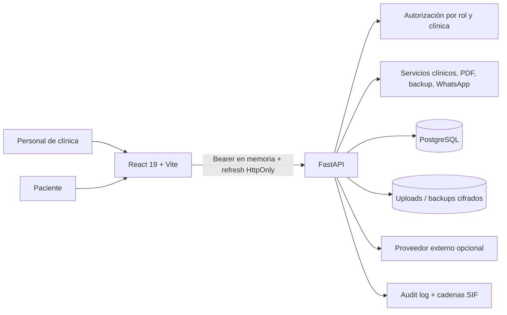

# Auditoría de arquitectura, seguridad y operaciones

**Fecha:** 2026-09-04  
**Alcance:** backend, frontend, datos, migraciones, CI/CD, Docker, seguridad y pruebas.

## Arquitectura actual

La separación frontend/API/servicios/base es razonable. FastAPI usa SQLAlchemy async, Pydantic explícito y Alembic lineal. React usa TanStack Query y lazy chunks por módulo. La mayor deuda está dentro de cada capa: routers con reglas de negocio, un cliente API monolítico, pantallas orquestadoras grandes y CSS acumulativo.

## Fortalezas técnicas comprobadas

- Producción valida secretos, hosts, cookie segura, clave de backup y destino externo (`backend/app/config.py:149`).
- La documentación OpenAPI se desactiva fuera de desarrollo y CORS limita origen, métodos y cabeceras (`backend/app/main.py:51`).
- Los campos de contacto principales del paciente se cifran en PostgreSQL (`backend/app/models/paciente.py:37`).
- El access token se mantiene en memoria y el refresh en cookie HttpOnly; claves antiguas se eliminan del storage (`frontend/src/lib/api.ts:135`).
- Los uploads validan tamaño, firma real, MIME y ruta; las descargas usan `no-store` y la baja documental es lógica (`backend/app/api/documentos.py:223`).
- Facturas selladas se anulan/rectifican sin borrado destructivo y generan registros SIF.
- Alembic tiene una cabeza (`0045`) y CI prueba una actualización incremental desde `0041`.
- Docker de producción usa build multi-stage y usuario no-root.
- Lint, build y suites pasan en la línea base.

## Hallazgos de seguridad

La severidad valora exposición de datos sanitarios, integridad clínica/económica y facilidad de explotación. Las ubicaciones son las de la línea base auditada.

### SEC-001 — Autorización ausente en historial clínico legacy

- **Severidad:** crítica
- **Regla:** autorización de objeto y rol en servidor para datos sanitarios
- **Ubicación:** `backend/app/api/tratamientos.py:305-345`, `:781-824`
- **Evidencia:** listar usa solo `paciente_id`; crear acepta `paciente_id`, `doctor_id` y `tratamiento_id` del payload; actualizar busca únicamente por `entrada_id`; ninguna de estas rutas verifica la clínica. Crear/actualizar quedan disponibles a cualquier rol staff por la dependencia global, incluida recepción.
- **Impacto:** lectura o modificación horizontal de historial por UUID y creación de registros clínicos atribuidos a otro paciente/profesional. Puede comprometer confidencialidad e integridad clínica.
- **Corrección:** cargar paciente/entrada, validar clínica, restringir escrituras a roles clínicos, comprobar relaciones y añadir pruebas negativas por rol y sede.
- **Mitigación temporal:** no exponer identificadores fuera de la UI y limitar red, aunque no sustituye la corrección.
- **Falso positivo:** no. Se confirmó la ausencia en código; las pruebas existentes no cubren estas rutas.

### SEC-002 — Logout y revocación no invalidan el access token

- **Severidad:** alta
- **Regla:** las decisiones de autorización deben reflejar revocación, desactivación y cambios de rol
- **Ubicación:** `backend/app/core/permissions.py:39-67`, `backend/app/api/auth.py:274-289`, `backend/app/config.py:45`
- **Evidencia:** el JWT contiene `sid`, pero `get_current_user` solo verifica firma/expiración y devuelve claims. Logout revoca la sesión de refresh; el access token sigue válido hasta 240 minutos. Tampoco se revalida `Usuario.activo`, rol o clínica.
- **Impacto:** una sesión cerrada/revocada o un usuario desactivado conserva acceso; cambios urgentes de permisos tardan horas en aplicarse.
- **Corrección:** validar usuario y `AuthSession` activa por request o usar una caché/revocation version con caducidad corta; comparar claims críticos con el estado actual.
- **Mitigación temporal:** reducir TTL del access token.
- **Falso positivo:** un token corto podría aceptar esta ventana por diseño, pero cuatro horas y datos sanitarios hacen que el riesgo siga siendo real.

### SEC-003 — Registros legacy sin clínica son visibles transversalmente

- **Severidad:** alta
- **Regla:** aislamiento fail-closed de tenant
- **Ubicación:** `backend/app/core/permissions.py:118-158`, `backend/alembic/versions/0014_multiclinica_telemedicina_inventario.py:37`
- **Evidencia:** `ensure_clinic_access` acepta cualquier registro con `clinica_id=None`; los listados de un usuario con clínica incluyen `own OR NULL`. La base auditada contiene 2 pacientes, 28 citas, 4 doctores, 1 odontograma y 1 presupuesto sin clínica.
- **Impacto:** personal asignado a distintas sedes puede compartir datos legacy sin una decisión explícita de pertenencia.
- **Corrección:** inventariar y asignar datos, introducir una política explícita para registros globales permitidos y pasar los dominios clínicos a `NOT NULL` mediante migración segura por fases.
- **Mitigación temporal:** bloquear acceso a `NULL` para no-admin en dominios sanitarios después de resolver los registros activos.
- **Falso positivo:** podría ser intencional para catálogos globales; no es aceptable como regla común para pacientes, citas u odontogramas.

### SEC-004 — Salud puede filtrarse por el campo de observación general

- **Severidad:** alta
- **Regla:** minimización y separación por sensibilidad
- **Ubicación:** `backend/app/api/pacientes.py:84-126`, `frontend/src/modules/pacientes/FichaPaciente.tsx:342`, `:600`
- **Evidencia:** recepción recibe `datos_salud=None`, pero recibe `observaciones`; la ficha usa la observación general como alerta fallback. En la ejecución real, recepción vio “Alérgico a la penicilina” desde ese campo mientras Salud decía que no había alergias.
- **Impacto:** el control de campo queda anulado por datos clínicos introducidos en un contenedor administrativo libre.
- **Corrección:** separar alertas clínicas/administrativas, restringir la primera y ofrecer migración/reclasificación asistida.
- **Mitigación temporal:** instrucción de uso y advertencia en el formulario.
- **Falso positivo:** el registro concreto demuestra que el patrón ocurre; el alcance sobre otras instalaciones requiere inventario.

### SEC-005 — Cadena de auditoría susceptible a bifurcación concurrente

- **Severidad:** alta
- **Regla:** integridad transaccional de registros append-only
- **Ubicación:** `backend/app/core/audit.py:108-127`, `backend/app/services/audit.py:53-68`, `backend/app/models/audit_log.py:36`
- **Evidencia:** dos escritores leen el último hash sin bloqueo/serialización y pueden insertar eventos con el mismo `previous_hash`; `event_hash` no es único. El middleware escribe en otra transacción después de la respuesta y registra el fallo solo en log.
- **Impacto:** la cadena puede bifurcarse o perder eventos aunque la operación clínica/económica tenga éxito, reduciendo la fuerza probatoria y diagnóstica.
- **Corrección:** serializar por clínica/cadena con advisory lock o cabeza bloqueada, definir verificación explícita y decidir qué eventos críticos deben ser atómicos con el cambio.
- **Mitigación temporal:** monitor periódico de integridad y alerta ante bifurcaciones.
- **Falso positivo:** con un único worker y baja concurrencia la ventana es pequeña, pero producción configura varios workers.

### SEC-006 — IP y throttling confían en `X-Forwarded-For` sin proxy confiable

- **Severidad:** media
- **Regla:** no confiar en cabeceras controladas por cliente
- **Ubicación:** `backend/app/core/audit.py:139`, `backend/app/services/audit.py:15`, `backend/app/api/auth.py:39`, `backend/app/core/throttling.py:68`
- **Evidencia:** el primer valor de `X-Forwarded-For` se acepta directamente para rate limit y auditoría.
- **Impacto:** si el backend es alcanzable sin un proxy que reescriba la cabecera, un atacante puede rotar la identidad de rate limit o falsear IP de auditoría.
- **Corrección:** aceptar forwarded headers solo si `request.client.host` pertenece a proxies configurados; compartir helper probado.
- **Mitigación temporal:** impedir acceso directo al backend desde redes no confiables.
- **Falso positivo:** despliegues con proxy que borra/reescribe la cabecera reducen el riesgo, pero no está impuesto por aplicación.

### SEC-007 — 2FA se activa antes de confirmar y el secreto queda en claro

- **Severidad:** media
- **Regla:** enrolamiento MFA confirmado y secreto protegido
- **Ubicación:** `backend/app/api/auth.py:307-328`, `backend/app/models/usuario.py:30`
- **Evidencia:** `2fa-enable` persiste inmediatamente el secreto y no existe endpoint de confirmación OTP; el secreto se almacena como `String(64)` sin cifrado de aplicación/DB.
- **Impacto:** bloqueo accidental de cuenta y exposición de seeds MFA ante lectura de base.
- **Corrección:** estado pending, confirmación OTP, códigos de recuperación y cifrado con rotación documentada.
- **Mitigación temporal:** solo activar durante sesión asistida y custodiar backups/DB.
- **Falso positivo:** el cifrado de disco no protege frente a acceso lógico a la base.

### SEC-008 — Rate limit en memoria no funciona como límite global

- **Severidad:** media
- **Regla:** controles antiabuso consistentes en despliegue multi-worker
- **Ubicación:** `backend/app/core/throttling.py:1-116`, `backend/Dockerfile.prod:43`
- **Evidencia:** contadores en diccionario de proceso; producción usa varios workers.
- **Impacto:** límites multiplicados e inconsistentes, sin coordinación entre réplicas.
- **Corrección:** almacén compartido o limitación en gateway, con claves confiables y métricas.
- **Mitigación temporal:** límite en reverse proxy.
- **Falso positivo:** en desarrollo con un proceso funciona como se espera.

### SEC-009 — Cola offline puede almacenar payloads sensibles sin cifrado

- **Severidad:** media condicionada
- **Regla:** minimizar persistencia local de PII sanitaria
- **Ubicación:** `frontend/src/lib/offline.ts:1-44`, `frontend/src/modules/adminExtras/index.tsx:455`
- **Evidencia:** IndexedDB acepta `payload` arbitrario; hoy la UI solo crea un paciente demo, pero el texto promete sincronizar datos pendientes.
- **Impacto:** una ampliación natural podría dejar PII en perfiles compartidos del navegador sin expiración ni cifrado.
- **Corrección:** limitar schema y datos, expiración, borrado al cerrar sesión y threat model antes de habilitar offline real.
- **Mitigación temporal:** mantener la función solo en demo/admin y no guardar salud/documentos.
- **Falso positivo:** no se observó PII real actualmente; el hallazgo previene una expansión insegura.

### SEC-010 — Hardening web y supply chain incompletos

- **Severidad:** baja/media
- **Regla:** defensa en profundidad y builds reproducibles
- **Ubicación:** `frontend/nginx.conf:10`, `backend/pyproject.toml:7`, `.github/workflows/ci.yml:27`
- **Evidencia:** nginx no define CSP ni Permissions-Policy; Python usa solo límites inferiores y no hay lock/constraints ni auditoría de dependencias en CI. Las actions están fijadas por tag mayor, no SHA.
- **Impacto:** mayor superficie ante XSS/dependencia comprometida y builds backend no deterministas.
- **Corrección:** CSP compatible, Permissions-Policy, lock de Python, escaneo CI y pinning reforzado.
- **Mitigación temporal:** `npm audit --omit=dev` fue limpio y los secretos de producción se validan.
- **Falso positivo:** CSP debe diseñarse con las integraciones reales; no debe desplegarse una política rota.

## Integridad clínica y económica

- Pacientes y documentos usan baja lógica; catálogos se desactivan.
- Facturas/cobros emitidos se anulan con trazabilidad.
- El historial clínico y los presupuestos todavía tienen endpoints de borrado físico (`tratamientos.py:813`, `presupuestos.py:731`). Esto contradice el principio de no borrar información clínica/económica sensible.
- `HistorialClinico` no contiene `clinica_id`; hereda el scope a través del paciente. Toda consulta directa debe cargar/validar esa relación.
- `Paciente.datos_salud` sigue siendo JSON libre, aunque existe copia cifrada. La flexibilidad dificulta validación, evolución de schema, mínimos de acceso y analítica segura.
- Las transacciones del circuito presupuesto/factura están razonablemente agrupadas, pero la auditoría del middleware queda fuera de ellas.

## Arquitectura backend

### Concentración

Los routers más grandes combinan HTTP, consultas, reglas, transiciones, PDF y auditoría:

- `citas.py`: 1.018 líneas, 21 rutas;
- `presupuestos.py`: 950 líneas, 17 rutas;
- `odontograma.py`: 937 líneas, 12 rutas;
- `facturas.py`: 875 líneas, 21 rutas;
- `tratamientos.py`: 824 líneas, 18 rutas;
- `laboratorio.py`: 817 líneas, 14 rutas.

No se propone una capa de servicios para cada CRUD. Sí conviene extraer las transiciones críticas y políticas compartidas: autorización de recurso, cierre de sesión, presupuesto→pendiente, emisión/anulación fiscal y cadena de auditoría.

### Consultas y escalabilidad

Pacientes y facturas tienen `limit/offset`; historial clínico, presupuestos, citas por paciente, documentos y varios catálogos devuelven listas completas. El frontend compone el timeline en memoria. Esto funciona con la semilla actual, pero escala mal en pacientes longitudinales y clínicas grandes.

TanStack Query está bien aplicado, aunque el workspace de paciente activa simultáneamente muchas queries. Hay invalidaciones explícitas y tests para ellas, pero falta una clave/capa de dominio central para evitar divergencia.

## Arquitectura frontend

### Hotspots

| Archivo | Tamaño aproximado | Riesgo |
|---|---:|---|
| `frontend/src/index.css` | 21.203 líneas / 540 KB en bundle | cascada acumulativa, duplicación y regresiones visuales |
| `styles/layout-foundation.css` | 7.113 líneas | overrides por módulo y breakpoint difíciles de razonar |
| `lib/api.ts` | 1.974 líneas / chunk 127 KB | transporte, demo fallback y todos los dominios acoplados |
| `modules/agenda/index.tsx` | 1.768 líneas | formulario, agenda, filtros y mutaciones juntos |
| `modules/pacientes/index.tsx` | 1.568 líneas / chunk 282 KB | orquestación de casi todo el paciente |
| `ClinicalWorkspace.tsx` | 1.358 líneas | cinco flujos clínicos en un componente |
| `FichaPaciente.tsx` | 1.127 líneas | resumen y formularios múltiples |

El build no emite error, pero produce CSS principal de 539 KB, JS principal de 446 KB y chunk de pacientes de 282 KB sin gzip. La división actual evita una descarga monolítica total, pero no una carga pesada dentro del módulo más usado.

## Pruebas y CI

La línea base es saludable pero desigual:

- backend: 152 tests, 65% cobertura;
- frontend: 250 tests en 40 archivos;
- E2E: un solo escenario y toda la API se intercepta;
- CI: Postgres real, migraciones, Ruff, pytest, ESLint, build, Vitest y Chromium.

Prioridad de pruebas: autorización clínica, revocación de sesión, multi-clínica con legacy, presupuesto→pendiente→realizado→factura→cobro, restauración real y flujos por rol sin mocks.

## Operaciones y documentación

El preflight real mostró 13 checks correctos, 8 avisos y 3 fallos:

1. administrador sin 2FA;
2. restauración simulada con incidencias de estructura;
3. ninguna restauración real registrada.

También falta copia externa verificada. Un backup cifrado descargable no demuestra recuperación.

Existe deriva documental: `docs/arquitectura.md` y `docs/modulos.md` aún describen como pendiente el token del portal; `mapa-funcional-clinica.md` habla de token en `sessionStorage`; `AUDIT_CURRENT_STATE.md` referencia una cabeza de migración y resultados de tests anteriores. Se necesita un índice de documentos vigentes y caducados.

## Requisitos de revisión externa

- **LEGAL_REVIEW_REQUIRED:** bases jurídicas, información al paciente, conservación/bloqueo/borrado, ejercicio de derechos y contratos de encargo para RGPD/LOPDGDD.
- **LEGAL_REVIEW_REQUIRED:** adecuación de consentimientos y firma a cada tratamiento/proceso.
- **LEGAL_REVIEW_REQUIRED:** cumplimiento del sistema de facturación, declaración responsable, VERI*FACTU/SIF y calendario aplicable.
- **LEGAL_REVIEW_REQUIRED:** receta electrónica/proveedor, identificación/firma del prescriptor y validez de PDFs locales.
- **LEGAL_REVIEW_REQUIRED:** transferencias, DPA, ubicación y retención de audio/LLM/WhatsApp antes de activar proveedores reales.

## Estrategia recomendada

1. Corregir autorización clínica y revocación.
2. Diseñar la salida segura de `clinica_id=NULL` sin reasignar datos automáticamente.
3. Hacer la auditoría concurrente/verificable y eliminar borrados destructivos.
4. Demostrar restauración y E2E real.
5. Extraer políticas/transiciones de routers antes de añadir nuevos dominios.
6. Paginar/cargar bajo demanda historial y paciente.
7. Modularizar CSS y API por zonas que ya vayan a cambiar; no hacer un refactor cosmético global.

El plan y los estados viven exclusivamente en `IMPROVEMENT_BACKLOG.md`.
