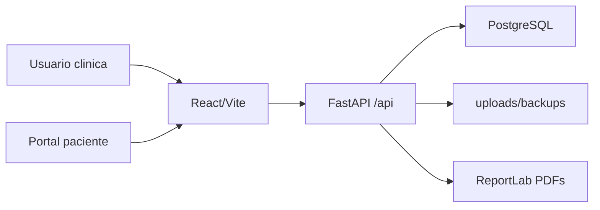

# Arquitectura

## Vision general

DentOrg2.2 es una aplicacion web clinica con separacion clara entre backend, frontend y base de datos.

## Backend

Carpeta principal: `backend/app`.

- `main.py`: crea la app FastAPI, middlewares y routers.
- `api/`: routers por modulo.
- `models/`: modelos SQLAlchemy.
- `schemas/`: schemas Pydantic y enums.
- `services/`: logica compartida, agenda, auditoria, backups.
- `core/`: seguridad, permisos, cabeceras, cifrado.
- `alembic/versions/`: migraciones.

Patrones usados:

- SQLAlchemy async con `AsyncSession`.
- Routers por dominio, montados bajo `/api`.
- Dependencias comunes de autenticacion y permisos.
- Auditoria mediante `write_audit_log` y middleware.
- Aislamiento multi-clinica con `ensure_clinic_access`, `resolve_clinic_id` y `scope_select_by_clinic`.

## Frontend

Carpeta principal: `frontend/src`.

- `App.tsx`: rutas principales y proteccion por rol.
- `components/`: layout, navegacion, estado global, error boundary.
- `modules/`: pantallas funcionales.
- `lib/api.ts`: cliente Axios y capa API.
- `types/api.ts`: tipos TypeScript compartidos.
- `config/workflow.ts`: navegacion y reglas visibles por rol.
- `index.css`: sistema visual principal.

Patrones usados:

- React Query como fuente de sincronizacion con backend.
- Estado local solo para UI temporal, modales y filtros.
- Rutas protegidas por autenticacion y rol.
- Vistas densas tipo software de clinica, evitando landing pages.

## Seguridad

La seguridad se apoya en varias capas:

- JWT access/refresh.
- Roles: admin, doctor, recepcion, auxiliar, paciente.
- Restricciones multi-clinica.
- Cifrado de datos sensibles de paciente con pgcrypto.
- Auditoria de acciones sensibles.
- Cabeceras de seguridad y CORS configurable.
- Soft delete en entidades clinicas/fiscales sensibles cuando aplica.

## Datos y ficheros

- PostgreSQL almacena datos transaccionales.
- `uploads/pacientes/{paciente_id}` almacena documentos y PDFs generados.
- `backups` almacena copias segun configuracion.
- PDFs fiscales y consentimientos firmados se tratan como documentos archivados, no como documentos regenerables libremente.

## Limitaciones conocidas

- El portal paciente aun usa seleccion `paciente_id` para previsualizacion interna; falta token publico o relacion persistente `Usuario.paciente_id`.
- El modo no verificable/XAdES completo no esta implementado.
- El bundle frontend avisa de chunk grande; se puede dividir por rutas en una fase de optimizacion.
